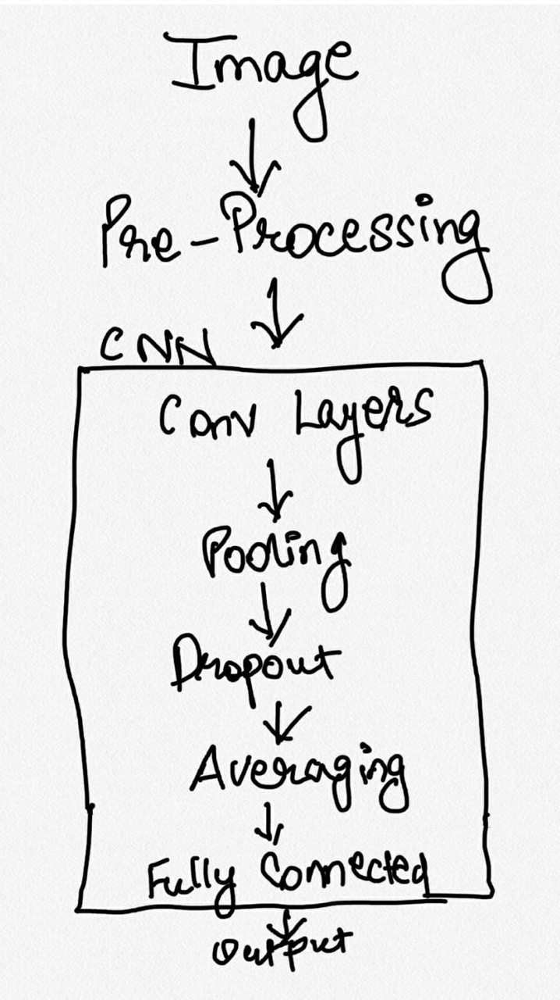

# Machine Learning Engineer Nanodegree
## Capstone Proposal
Harshvardhan Aggarwal  
September 17th, 2017

## Classifying Restaurant Images

### Domain Background

This project focuses on analyzing and predicting various types of labels a Restaurant may have. Many of the problems today lie in correctly classifying the images, and restaurant classification is one of them. With growing number of restaurants, it becomes difficult to filter out restaurants based on specific category.

With users wanting a good recommendation for trying out new restaurants, it become increasingly necessary to develop a robust machine learning algorithm that can correctly classify restaurants based on various parameters like the quality of food, average wait times, kid friendly etc. This problem is just a stepping stone in classifying different types of business and their qualities in order to provide better services than manual task are able to achieve.

### Problem Statement

The main goal of this project is to look at various pictures of a restaurant business, identify its core features from the images and classify them based on their features. There are thousands of photos uploaded by users everyday in different lighting conditions, shapes, angle that it becomes difficult to properly tag them without the help of automated system.

The problem can be considered as a classification problem, where images can have multiple class labels assigned to them. A user searching for a particular restaurant, say kid friendly, will help deliver results which are useful to them and in the end saving time.

### Datasets and Inputs

The dataset for this problem is obtained from Kaggle Competition "Yelp Restaurant Photo Classification" (Refer [1] and [2]). This dataset contains thousands of user uploaded images for restaurants. These images contain images of food, drinks of various cuisines, restaurant interiors, exteriors etc belonging to a particular restaurant. Similarly for all other restaurants, several types of images are present.

The dataset also contains mapping of photos to a particular business in both train and test set. The images are of high quality and mostly have different height and width. These will require some kind of Pre-processing to make all the images of same dimensions and to correctly map the images with business.

The dataset also has 9 categories of labels to be predicted upon. They are:
1. good_for_lunch
2. good_for_dinner
3. takes_reservations
4. outdoor_seating
5. restaurant_is_expensive
6. has_alcohol
7. has_table_service
8. ambience_is_classy
9. good_for_kids

Each business owner can have multiple photos which can then be assigned multiple labels depending on the image.

### Solution Statement

The solution I am trying to build is to enable a photo which is uploaded by user to be correctly classified and labeled through machine learning. The label generated by machine learning algorithm will be compared to the labelled data provided in a separate file. The algorithm will calculate the number of labels correctly identified and vice versa and adjust accordingly. Finally, there are test data on which algorithms reliability will be measured and an accuracy score is calculated.

For starter, I will build a simple decision tree model which can classify the images into its own separate category like food, menu, place, ambience etc. This labelled data can be used as input to a CNN architecture.

The CNN architecture would use transfer learning by utilizing existing networks like ResNet50 to train on pre-calculated weights. By removing the last layers of ResNet50 and adding own layers with a deep architecture will help to provide a better classification of images. I also plan to integrate Caffe framework as explained here [3].

### Benchmark Model

The benchmark model can be measured by comparing the labels generated for a particular image and the predicted labels generated by the algorithm. If we have the following definitions or classes of images:
1. True Positives - No of images correctly labelled as Label_1.
2. False Positives - No of images labelled as say Label_1 although the actual label is not Label_1.
3. False Negatives - No of images classified as not Label_1 but they are actually Label_1 image.
4. True Negatives - No of images correctly classified as not Label_1.

The F(beta) score and test error rate are good benchmarks for this problem. On Kaggle page for this problem [4], the F(beta) score is 0.64597 with random guessing algorithm.

The ImageNet consists of millions of images being labelled into thousands of categories. The AlexNet network classified the images in ImageNet Large-Scale Visual Recognition Challenge 2010 with a top-5 test error rate of 17% [5]. This benchmark model would serve as basis of how my algorithm is working.

### Evaluation Metrics
The following evaluation metrics can be used in this case:
1. F(beta) score (from Kaggle evaluation method)
   The F(beta) score can be calculated as a measure of precision and recall.

   Precision = Sum (True Positives) / Sum (True Positives + False Positives)
   Recall = Sum (True Positives) / Sum (True Positives + False Negatives)

   ###### F(beta) =  
              (1 + beta^^2) * (precision * recall) /
              (beta^^2 * precision) + recall

  The benchmark model for this problem has a F-beta score of 0.64597 with random guessing algorithm [3]. A solution model having F-beta score _more_ than the benchmark model can be considered as good model.

### Project Design

The project design would include a number of steps as follows:

1. The image dataset is in JPEG format. I need to first convert the images into consistent dimensions for processing.

2. Secondly, some of the images are in high quality while some of them are in low quality. Pre-processing of images is required to make them of same quality without loss of information. Gaussian blurring is a good method to smooth out noise from the image.

3. The output labels are in text format. One-hot encoding the labels is required so as to correctly classify the images.

4. After pre-processing the images in above steps, I can use Convolution Neural Networks to extract features from these images. Since there are lots of images with different categories, a large CNN network with multiple layers of Convolution, Pooling, Averaging, Activation and fully-connected layers is required.

A rough drawing for the algorithm would look like below:

### References and citations
1. Kaggle Competition Page - https://www.kaggle.com/c/yelp-restaurant-photo-classification

2. Dataset for Project - https://www.kaggle.com/c/yelp-restaurant-photo-classification/data

3. Caffe Framework and Integration with Yelp DB - https://engineeringblog.yelp.com/2015/10/how-we-use-deep-learning-to-classify-business-photos-at-yelp.html

4. Kaggle Benchmark Model value - https://www.kaggle.com/c/yelp-restaurant-photo-classification/leaderboard

5. AlexNet Image classification on ImageNet - http://www.cs.toronto.edu/~fritz/absps/imagenet.pdf
